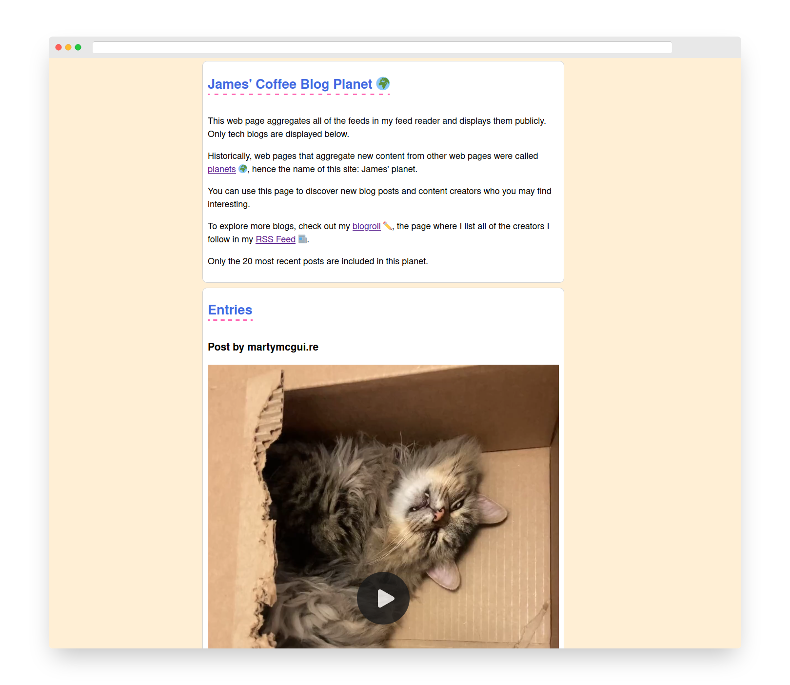

# James' Planet

James' Planet is a site that displays new entries from the tech blogs James follows.

This site makes a Microsub request to a Micropub server endpoint for a specified channel. That channel is then queried to find the latest entries.

To deploy this service for yourself, you must have access to a Microsub-compatible server.

A public version of this project is available at [planet.jamesg.blog](https://planet.jamesg.blog)

## Screenshot

## Setup

First, install the required dependencies for this project:

    bundle install

Next, create a .env file with the following values:

    MICROSUB_URL=https://microsub.jamesg.blog/microsub
    MICROSUB_TOKEN=<your token>
    MICROSUB_CHANNEL=<your channel>

The URL is the full URL of your Microsub endpoint. The token is an authentication token that will let you access your server. The channel is the channel you want to query.

Once you have set up your configuration file, you are ready to run the project. You can do so by running this command in the main project directory:

    ruby app.rb

## My Site

My blog, jamesg.blog, runs on letsjam. Here is a screenshot of my site home page, generated with letsjam:

## Technologies Used

- Ruby
- Sinatra
- net/http

## Licence

This project is licensed under the [MIT License](LICENSE)

## Contributors

- capjamesg